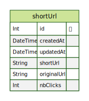

# Lunii : Url Shortner

## Init le projet

- Installer [pnpm](https://pnpm.io/installation#using-corepack) si vous ne l'avez pas encore.
- Duppliquer le `.env.example` et le renommez en `.env`.
- lancer `pnpm install` à la racine du projet pour installer les dépendances.

### Lancement de la base de données avec Docker

Placez-vous dans le repertoire `apps/api`.  
Monter le container docker

```sh
cd apps/api
pnpm docker:development up
```

> Prisma ne prends pas encore en charge l'utilisation de `nanoid`.  
> C'est pourquoi j'ai dû faire une configuration en me basant sur [cette solution](https://github.com/prisma/prisma-engines/pull/3556#issuecomment-1375928358) ainsi que [cet article](https://dev.to/reggi/how-to-use-a-custom-generated-nanoid-for-prisma-primary-key-3nbf) pour utiliser les migrations.

### Initialiser la base de données

Placez-vous dans le repertoire `packages/database` dans un nouveau terminal.  
Lancer la commande `pnpm db:migrate`.  
Cela aura pour effet d'appliquer toute les migrations du dossier `/packages/database/src/migrations`.

```sh
cd packages/database
pnpm db:migrate
```

### Seed

Lors de la première initialisation avec la commande `db:migrate` la seed sera lancer automatiquement.
Vous pouvez retrouver le code dans `packages/database/src/seed.ts`  
Vous pouvez visualiser les données en lançant la commande `pnpm db:studio` qui vous ouvrira alors Prisma Studio dans votre navigateur.

```sh
pnpm db:studio
```

### Entity-Relationship Diagram



### Lancer le back

```sh
cd apps/api
pnpm run dev
```

### Lancer le front

```sh
cd apps/web
pnpm run dev
```

### Lancer les tests

```sh
cd apps/api
pnpm run test
```

## What's inside?

This Turborepo includes the following:

### Apps and Packages

- `web`: a [Next.js](https://nextjs.org/) app
- `api`: an [Express](https://expressjs.com/) server
- `@repo/ui`: a React component library
- `@repo/logger`: Isomorphic logger (a small wrapper around console.log)
- `@repo/eslint-config`: ESLint presets
- `@repo/typescript-config`: tsconfig.json's used throughout the monorepo
- `@repo/jest-presets`: Jest configurations
- `@repo/database`: Prisma database configuration

Each package/app is 100% [TypeScript](https://www.typescriptlang.org/).

### Utilities

This Turborepo has some additional tools already setup for you:

- [TypeScript](https://www.typescriptlang.org/) for static type checking
- [ESLint](https://eslint.org/) for code linting
- [Jest](https://jestjs.io) test runner for all things JavaScript
- [Prettier](https://prettier.io) for code formatting
